<!-- markdownlint-disable MD013 -->
<!-- markdownlint-disable MD060 -->
# Intelligent-Crop-Recommendation-System

## Team Members

|Name                | Roll Number|
|--------------------|------------|
|Denzel Robin        | 2023BCS0189|
|Ron Stephen Mathew  | 2023BCS0192|
|Adithya T J         | 2023BCS0195|
|Muhammed Minhaj P S | 2023BCS0225|

## Problem Statement

Agriculture plays a critical role in global food production. However,
many farmers select crops based on market rather than data.
This leads to:

- Low crop yield
- Poor soil utilization
- Financial losses
- Inefficient farming decisions

There is a need for a data-driven recommendation system that can
suggest the most suitable crops based on soil and environmental
conditions.

## Objectives

- Build an Intelligent Crop Recommendation System
- Use data mining techniques to analyze agricultural data
- Recommend crops based on:
  - Nitrogen
  - Phosphorus
  - Potassium
  - Temperature
  - Humidity
  - Soil pH
  - Rainfall
- Provide accurate predictions using machine learning

## Dataset

**Source:** [kaggle](https://www.kaggle.com/datasets/atharvaingle/crop-recommendation-dataset)  
**number of observations:** 2200  
**number of variables:** 7  

### Dataset Attributes

The dataset contains soil nutrients and environmental factors used to recommend suitable crops.

**Nitrogen (N):** Measures nitrogen content in soil, essential for plant growth and leaf development.  
**Phosphorus (P):** Indicates phosphorus level, important for root growth and energy transfer in plants.  
**Potassium (K):** Represents potassium content, which improves plant health and disease resistance.  
**Temperature:** Average environmental temperature (°C) affecting crop suitability.  
**Humidity:** Amount of moisture in the air, influencing crop growth conditions.  
**pH:** Soil acidity/alkalinity level, critical for nutrient availability.  
**Rainfall:** Amount of rainfall (mm), affecting water availability for crops.  
**Label:** Target variable representing the recommended crop type.  

## Methodology

### Exploratory Data Analysis

We performed:

- Dataset summary (mean, median, etc.)
- Distribution analysis using histograms
- Boxplots for outlier detection
- Correlation analysis using Pearson coefficient

### Data Preprocessing

Steps performed:

- Handling missing values (median imputation for P)
- Removing duplicate records
- Outlier analysis using IQR method
- (Outliers were not removed as they represent real crop conditions)

### Feature Engineering

New features were created to improve model performance:

- NP_ratio
- NK_ratio
- PK_ratio
- temp_humidity_interaction
- rainfall_ph_interaction

### Model Used: **XGBoost Classifier**

- Gradient boosting-based model
- Handles tabular data effectively
- Captures nonlinear relationships
- Robust to outliers

### Evaluation Methods

We used multiple evaluation techniques:

#### **Classification Metric**

- merror (multi-class error)

#### **Ranking Metrics**

- Top-K Accuracy (Top-1, Top-3, Top-5, Top-7)
- Mean Reciprocal Rank (MRR)

#### **Confusion Matrix**

- Shows correct and incorrect predictions per class

#### **Training Graph**

- Training vs validation error over iterations

## Results

- Implemented data driven crop selection
- Quick response from ML model
- Helps farmers make smart cultivation decisions

Testing results  
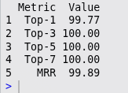

Confusion Matrix  
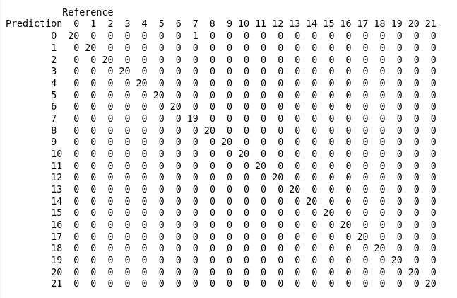

Training vs Validation Graph  
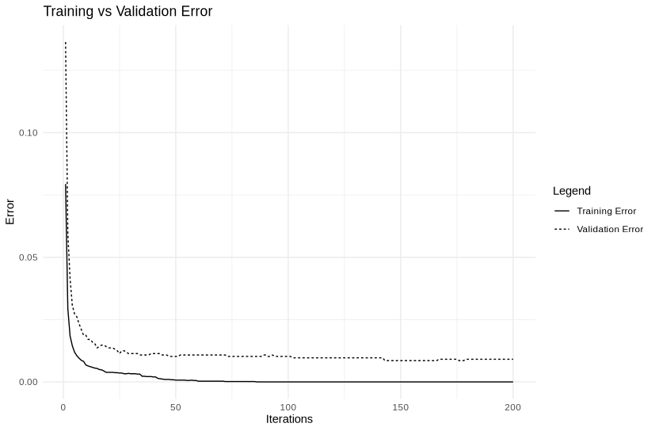

Application  
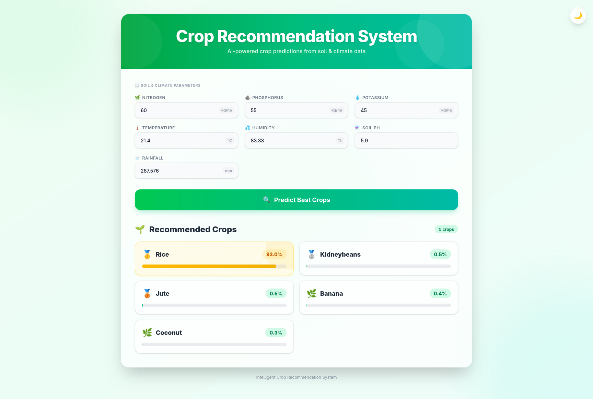

## Key Visualizations

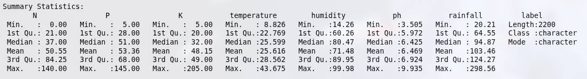

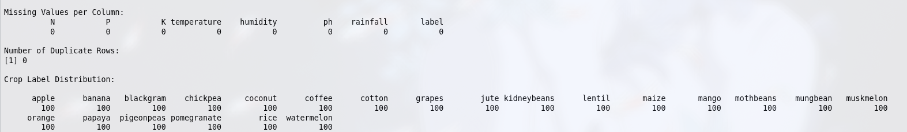

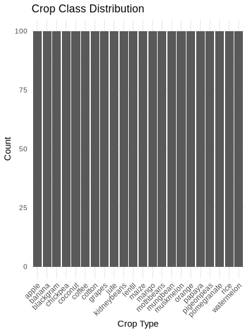

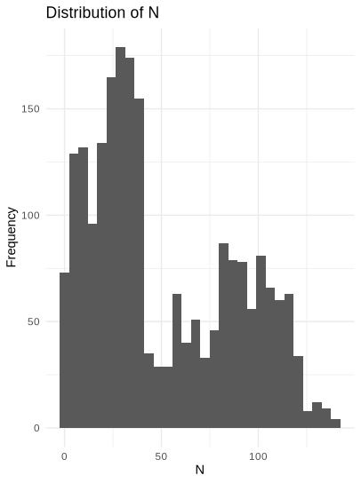

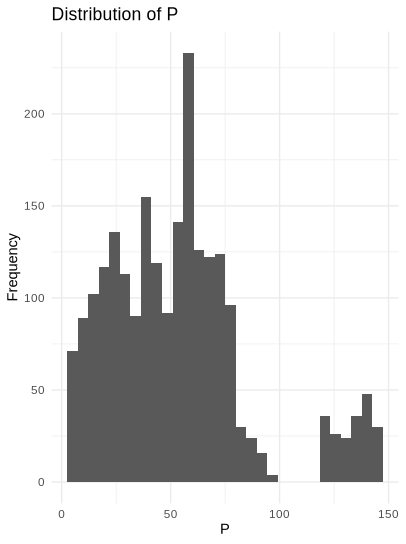

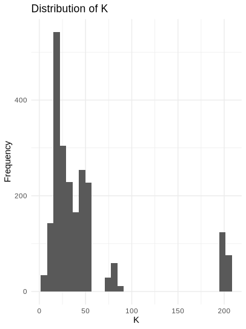

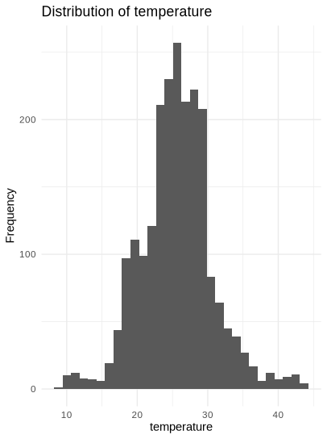

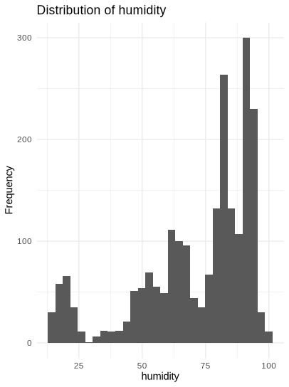

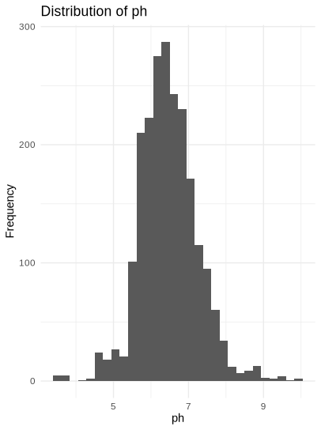

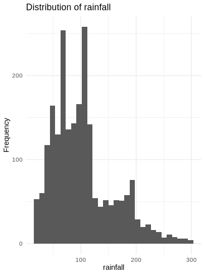

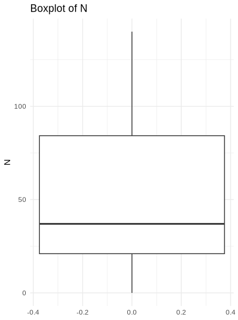

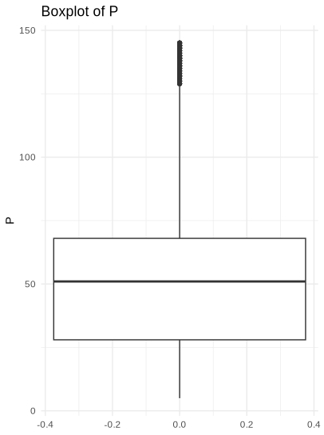

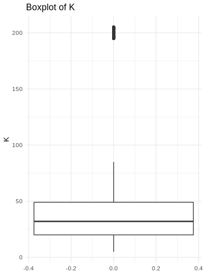

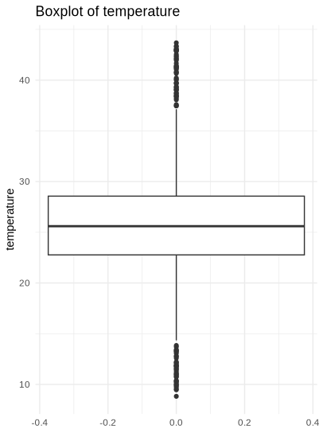

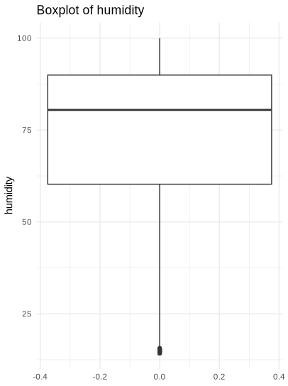

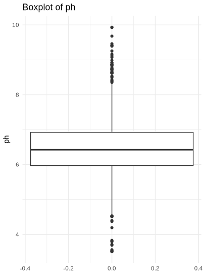

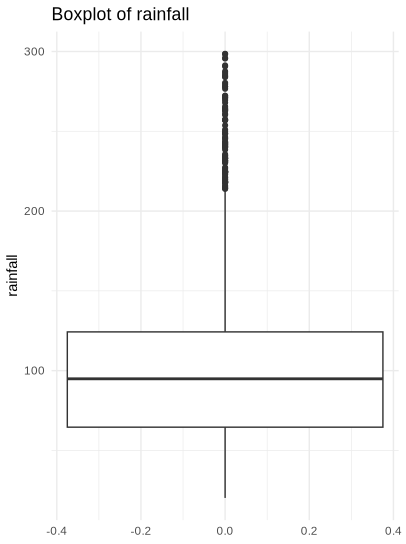

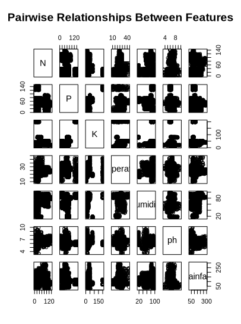

## How to run the project

### Use the model with frontend(GUI)

``` bash
git clone https://github.com/denzel-robin/Intelligent-Crop-Recommendation-System.git
```

``` bash
cd Intelligent-Crop-Recommendation-System
```

Docker compose must be installed on your system to run it.  
Give root permission to docker if needed.

``` bash
docker compose up
```

Open a browser and go to localhost:3000  
Ensure the port 3000 is free  
Turn off the compose after usage

``` bash
docker compose down
```

### Use the model in CLI

``` bash
git clone https://github.com/denzel-robin/Intelligent-Crop-Recommendation-System.git
```

``` bash
cd Intelligent-Crop-Recommendation-System/backend
```

Open R terminal

```bash
R
```

Download the requirements

``` R
source("requirements.R")
```

Run the CLI version of the app

``` R
source("scripts/06_recommendation_interface.R")
```

## Conclusions

The Intelligent Crop Recommendation System demonstrates how data
mining techniques can be applied to agriculture.

By analyzing soil nutrients and environmental conditions, the system
provides accurate crop recommendations that can help farmers make
better decisions and improve agricultural productivity.

## Contribtions

|Name                | Contributions                             |
|--------------------|-------------------------------------------|
|Denzel Robin        | API Creation, Frontend, Report Writing    |
|Ron Stephen Mathew  | XGBoost model creation                    |
|Adithya T J         | Data Preprocessing, hyperparameter tuning |
|Muhammed Minhaj P S | EDA, Visualizations                       |

## References

Dataset Source: [kaggle](https://www.kaggle.com/datasets/atharvaingle/crop-recommendation-dataset)  
XGBoost paper: [XGBoost](https://arxiv.org/abs/1603.02754)  
R documentation: [R](https://www.rdocumentation.org/)  
Using XGBoost: [XGBoost_in_R](https://www.statology.org/xgboost-in-r)
